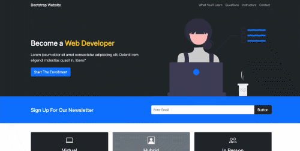

# Bootstrap Website

#### By Egemen Kar

## Preview

## Technologies Used

* HTML
* JavaScript
* CSS
* Bootstrap 5

## Description

I just created a simple one page website following a tutorial on [Traversy Media](https://www.youtube.com/channel/UC29ju8bIPH5as8OGnQzwJyA) Youtube Channel to practice my Bootstrap skills.

## Setup/Installation Requirements

* Clone this repository to your desktop.
* Navigate to the top level of the directory.
* Open index.html in your browser.

## License

Licensed under the [MIT License](LICENSE)

Copyright (c) 2021 Egemen Kar